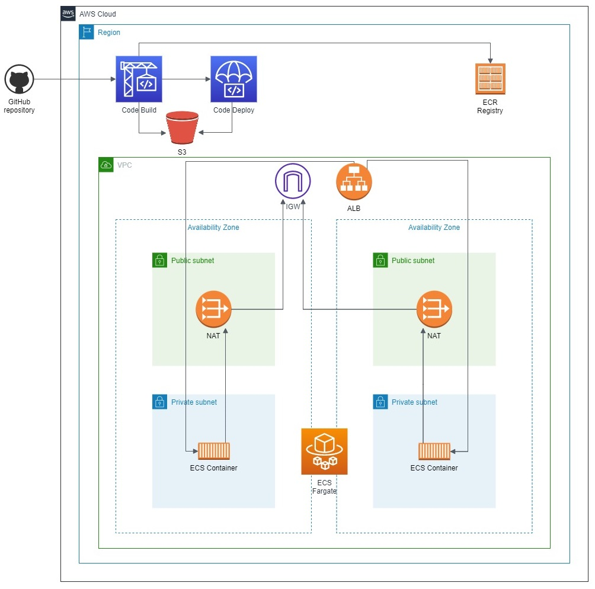

# nodejs-app
This is a basic Express app with some basic routes. It also includes Terraform files that create a CI/CD pipeline and ECS cluster with an ALB.

## Architecture diagram


## Getting Started
To get started with the app, you can follow these steps:

- Clone the repository to your local machine:
```
git clone https://github.com/rimvydascivilis/nodejs-app.git
```

- Install the dependencies:
```
cd nodejs-app
npm ci
```

- Start the app:
```
npm run start
```

## Terraform instructions
- Install [Terraform](https://developer.hashicorp.com/terraform/downloads).
- Navigate to the terraform directory in the app.
- You will need to change the *aws_account_id*, *codestar_connection_arn* variables in the *variables.tf* file to match your AWS account ID and the ARN of the CodeStar connection, here are aws guides on how to [create a connection](https://docs.aws.amazon.com/dtconsole/latest/userguide/connections-create-github.html).
- Run **terraform init** to initialize Terraform.
- Run **terraform apply** to create the resources in AWS.

## Routes
The following routes are available in the app:

- GET */hello* - Returns a simple "Hello, world!" message.
- POST */hello* - Returns a personalized greeting with the given name in the request body.
- GET */health* - Returns a simple "OK" message.
